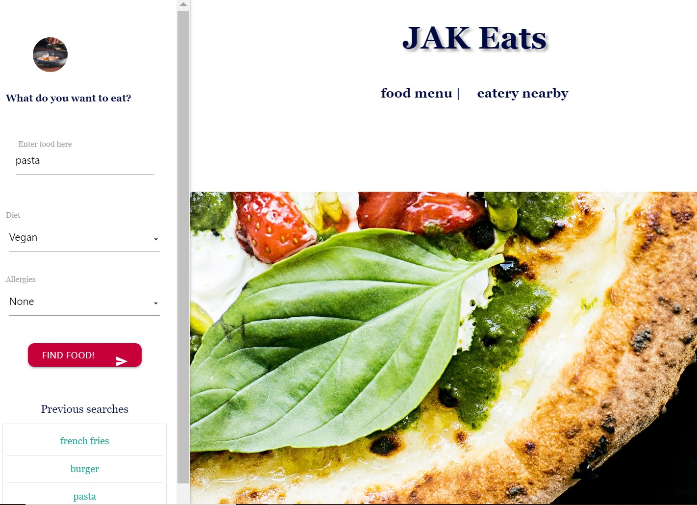
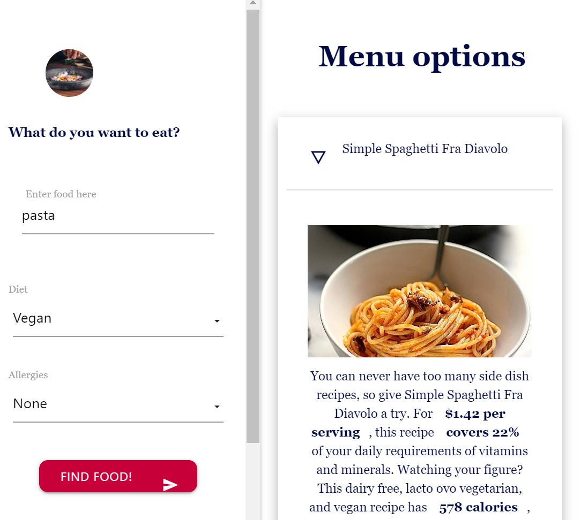
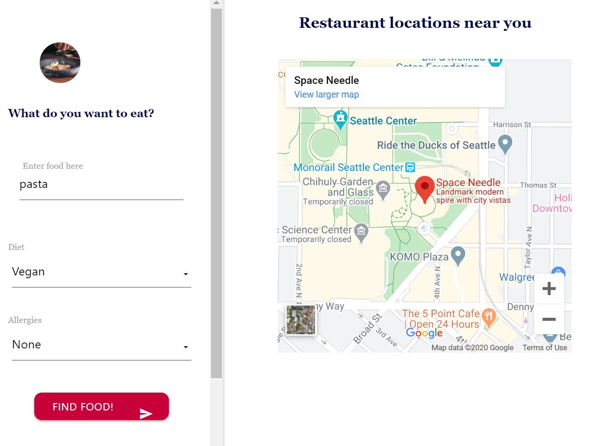

# JAK Eats

## Description
Online menu and restaurant options, with mapping to nearby restaurants.

## Built With
* JavaScript, jQuery
* Spoonacular and Google Maps APIs
* HTML
* CSS
* Materialize CSS

## Site and Repo location

* URL for the site
https://ktrnthsnr.github.io/JAK-eats

* GitHub file repo
https://github.com/ktrnthsnr/JAK-eats

## Contributors
Pops08, Drkeck, ktrnthsnr

### ©️2020 Pops08, ktrnthsnr, Drkeck

## Screenshot of the site splash page

## Screenshot of the site results from first API

## Screenshot of the site results from second API

## Token info
Note the API keys are not included in this version. 
If cloning to your local directory, create a config.js in the root, then add this var for each key:
   var theKey = {
     apiKey : 'apiKey=INSERTAPIKEYHERE',}
